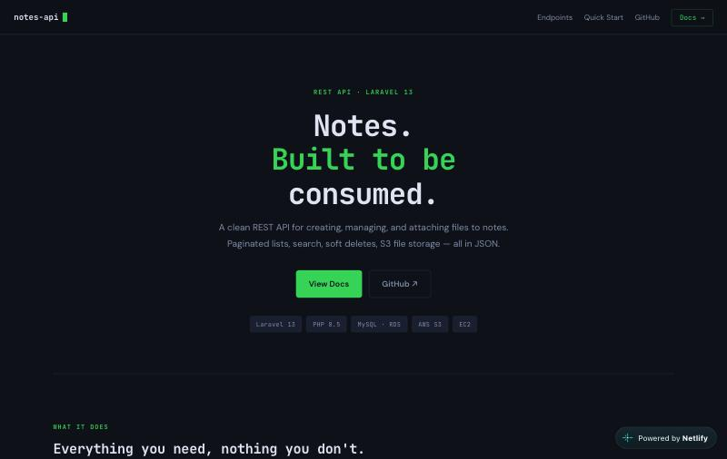

# Notes API

[**Live Docs →**](https://notes-api-dev.netlify.app/)



A clean REST API for creating, managing, and attaching files to notes. Built with Laravel 13, hosted on AWS EC2, with S3 file storage and MySQL on RDS.

## Stack

- **Backend:** Laravel 13 · PHP 8.5
- **Database:** MySQL (AWS RDS)
- **Storage:** AWS S3 (IAM role auth, no access keys)
- **Hosting:** AWS EC2

## Endpoints

| Method | Path | Description |
|--------|------|-------------|
| `GET` | `/api/notes` | List notes — paginated, filterable by `?search=` |
| `POST` | `/api/notes` | Create a note with optional file attachment |
| `GET` | `/api/notes/{id}` | Retrieve a single note |
| `PUT` | `/api/notes/{id}` | Update title, body, or replace file |
| `DELETE` | `/api/notes/{id}` | Soft-delete a note (restorable) |
| `POST` | `/api/notes/{id}/restore` | Restore a soft-deleted note |
| `DELETE` | `/api/notes/{id}/force` | Permanently delete note + S3 file |
| `POST` | `/api/notes/{id}/file` | Upload or replace file attachment |

## Features

- **CRUD + Search** — full create, read, update, delete with search across title and body
- **S3 File Storage** — attach jpg, png, or pdf (up to 5 MB) to any note, stored at `notes/{id}/filename`
- **Soft Deletes** — notes are soft-deleted by default, restorable with a single call, or permanently deleted with S3 cleanup
- **Request Validation** — dedicated form request classes validate every input, with file type and size limits enforced server-side
- **API Resources** — consistent JSON responses wrapped in Laravel API Resources with proper status codes and pagination meta
- **Interactive Docs** — auto-generated API docs at `/api-docs` with downloadable Postman collection at `/docs.postman`

## Quick Start

```bash
# Create a note
curl -X POST http://your-server/api/notes \
  -H "Content-Type: application/json" \
  -d '{"title": "First note", "body": "Hello world."}'

# Upload a file
curl -X POST http://your-server/api/notes/1/file \
  -F "file=@document.pdf"

# Search notes
curl http://your-server/api/notes?search=hello

# Soft-delete and restore
curl -X DELETE http://your-server/api/notes/1
curl -X POST http://your-server/api/notes/1/restore
```

## Local Setup

```bash
git clone https://github.com/haseebmirza/notes-api.git
cd notes-api
composer install
cp .env.example .env
php artisan key:generate
php artisan migrate
php artisan serve
```

## License

MIT
